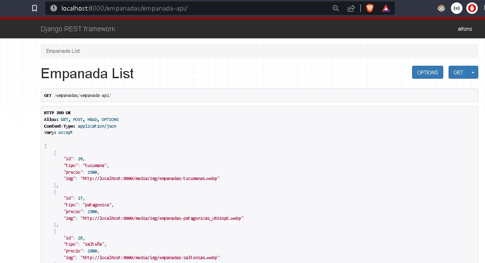
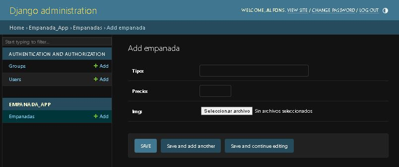

Integración del Front End con el Back End mediante Django Rest Framework
===

Proyecto "La Empanaderia"
---

* Vinculo del repositorio 
[La Empanaderia Front End](https://github.com/alfons-lopez/LaEmpanaderia)
* Vinculo del repositorio 
[La Empanaderia Back End](https://github.com/alfons-lopez/empanaderiaBack)
* Vinculo de la página web desplegada en pythonanywhere
[La Empanaderia Django](https://alfonsspj.pythonanywhere.com)
* Vinculo de la Api Rest (Django Rest Framework)
[Api Rest](https://alfonsspj.pythonanywhere.com/empanadas/empanada-api/)


#### Implementación de django views para generar las rutas y colocar los endpoints necesarios para que internamente reconozca los paths que el proyecto requiere.

- project_empanaderia/urls.py
```python
urlpatterns = [
    path('admin/', admin.site.urls),
    path('', Landing.as_view(), name="landing"),
    path('contacto/', Contacto.as_view(), name="contacto"),
    path('nosotros/', Nosotros.as_view(), name="nosotros"),
    path('nuestrosProductos/', NuestrosProductos.as_view(), name="nuestrosProductos"),
    path("empanadas/", include("empanada_app.urls")), 

] + static(settings.MEDIA_URL, document_root=settings.MEDIA_ROOT)

if settings.DEBUG:
    urlpatterns += static(settings.MEDIA_URL, document_root=settings.MEDIA_ROOT)
```

#### Configuración de los archivos statics y media que se requieren mostrar la página de manera funcional.

- project_empanaderia/settings.py

```python
STATIC_URL = 'static/'
STATICFILES_DIRS = [
    BASE_DIR / "static"
]

# Media files configuration
MEDIA_ROOT = os.path.join(BASE_DIR, 'media') 
MEDIA_URL = '/media/'

# Configuración de tipos MIME
import mimetypes
mimetypes.add_type("image/webp", ".webp")

```
#### Modelo definido en la aplicación
- empanada_app.py

```python
class Empanada(models.Model):
    tipo =  models.CharField(max_length=200)
    precio = models.PositiveSmallIntegerField(blank=False,null=False)  
    img = models.ImageField(default='', upload_to='img/') 
```

####  Se genero un CRUD con las apps de django y se integro con el front de django. Tambien se genero la api rest para ser consumida en el front end.






#### Integrantes del proyecto: Cintia Videla, Camila Cano, Alfonso López, Uriel Quintana


#### Tutor del Curso "Python full stack" - Codo a Codo: Anderson Ocana